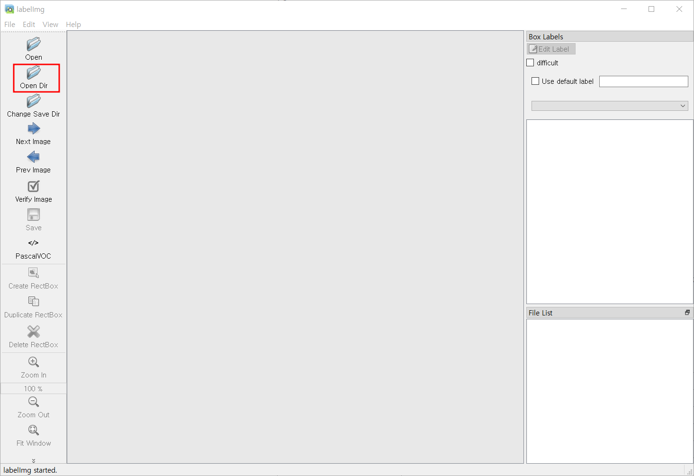
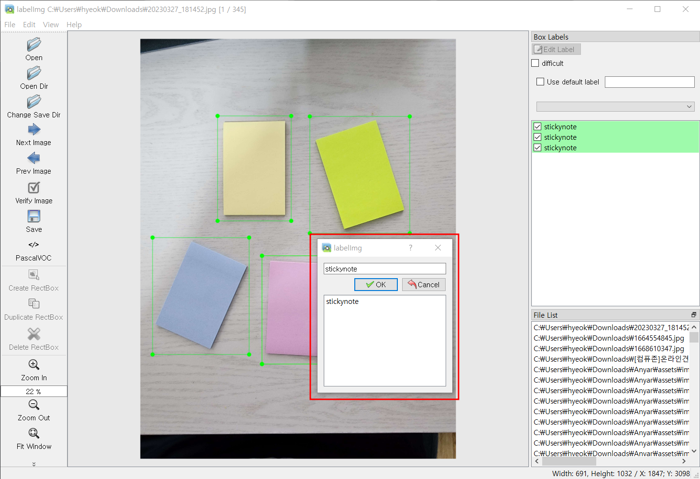
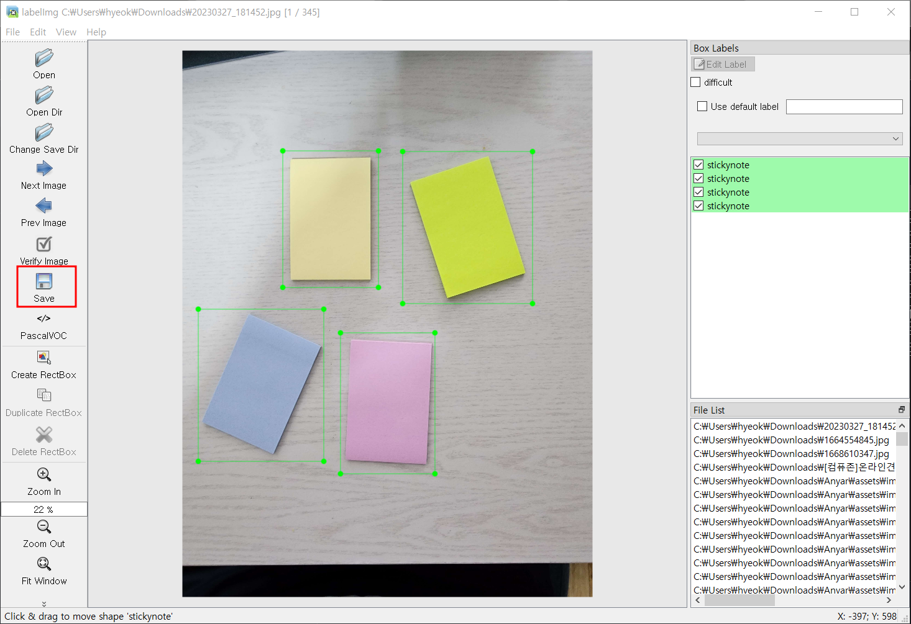
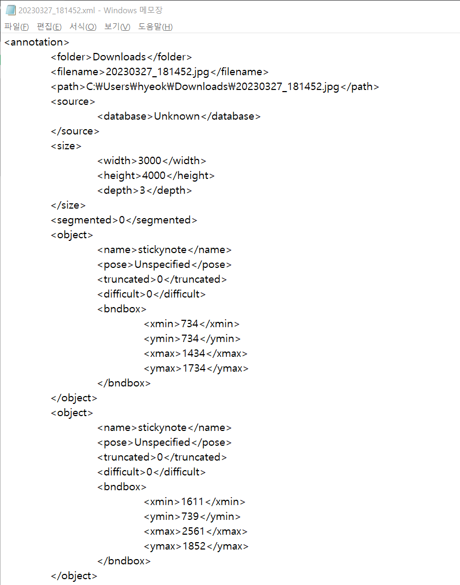

# 데이터 라벨링

## Repository
- [LabelImg](https://github.com/heartexlabs/labelImg)

## 환경
- Anaconda 22.9.0(Python 3.9.16)
- Windows 10 Pro

## 이미지 준비
학습할 이미지들을 한 폴더에 모두 넣는다, 이미지 파일명에는 가급적 특수문자 넣는것을 피한다.  
되도록 파일명을 20230327_181452.jpg와 같이 직관적으로 한다. (특수문자 삽입만 피하자)

## 설치
> !! labelImg에 python 버전 이슈있으므로 3.9로 설치한다. !!  
[python 버전 이슈](https://github.com/heartexlabs/labelImg/issues/811)
```bash
# 가상환경 생성(텐서플로 가상환경에서 설치할 경우 디펜던시 깨질 수 있음)
# labelImg에 python 버전 이슈 있음, 3.9로 설치
conda create -n labelimg python=3.9

# 가상환경 진입
conda activate labelimg

# labelImg 설치
pip install labelImg

# labelImg 실행
labelImg
```

## 라벨링
labelImg를 정상적으로 실행 후, 다음과 같은 화면, 'Open Dir'로 이미지 폴더 선택  

이미지 디렉토리 오픈, 이미지 로딩 및 목록 불러오는 것을 확인  
'Create RectBox' 클릭 혹은 단축키 'w'로 이미지 캡쳐 모드  

라벨링 모드는 PascalVOC로 설정한다. (기본값이 PascalVOC임)  
학습할 부분을 캡쳐 후, 다음 팝업창에서 'stickynote' 입력  

> 라벨링 시 라벨 이름 고정!
> 1. stickynote : 포스트잇 객체
> 2. wowboard-front : 와우보드 앞면 객체
> 3. wowboard-back : 와우보드 뒷면 객체  



이후 해당 이미지 내의 모든 학습할 부분 캡쳐 후 'Save'로 xml파일 저장



## 데이터 업로드
라벨링 완료된 데이터는 이미지 파일과 xml 파일 모두를 [팀 드라이브](https://kyonggiackr-my.sharepoint.com/:f:/g/personal/jamsilkes_kyonggi_ac_kr/En2IW2YjSPpIn_DMN7gLc1IBBM_A2cmBvMMqOg4x1qVQfQ?e=8m6rwQ) 내 알맞은 폴더에 업로드하여 학습에 사용될 수 있도록 한다. 

드라이브 접속 시 학교 계정 로그인 필수.
