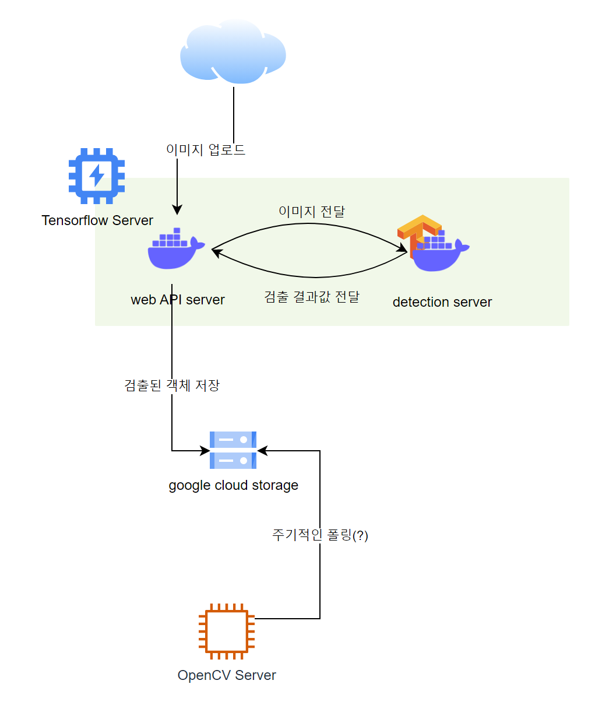

# wowboard-detector Serving

## 구성
추출한 모델을 Tensorflow Serving을 이용해 REST API 형식으로 Serving  
GCP를 이용하였으며, VM 생성 시 GPU(NVIDIA T4)를 추가로 설정하였음  
GPU를 이용하지 않는 방식으로도 구현 테스트 예정  


## 인프라 구조도
  


### VM Startup Script
```bash
#!/bin/bash
# GPU driver
curl https://raw.githubusercontent.com/GoogleCloudPlatform/compute-gpu-installation/main/linux/install_gpu_driver.py --output install_gpu_driver.py
python3 install_gpu_driver.py

# install docker
curl -fsSL https://get.docker.com -o get-docker.sh
chmod +x ./get-docker.sh
./get-docker.sh

# install nvidia-docker
distribution=$(. /etc/os-release;echo $ID$VERSION_ID) \
&& curl -s -L https://nvidia.github.io/nvidia-docker/gpgkey | sudo apt-key add - \
&& curl -s -L https://nvidia.github.io/nvidia-docker/$distribution/nvidia-docker.list | sudo tee /etc/apt/sources.list.d/nvidia-docker.list
apt update
apt install nvidia-docker2 unzip -y
systemctl restart docker

# pull docker image
docker pull tiangolo/uwsgi-nginx-flask
docker pull tensorflow/serving:2.11.0-gpu
```


### 웹 API 백엔드 
flask로 간단하게 구현, [uwsgi-nginx-flask docker](https://hub.docker.com/r/tiangolo/uwsgi-nginx-flask) 이미지를 사용함  
추후 detection 작업의 비동기화 처리시, FastAPI와 redis 등으로 작업 큐 관리를 구현예정 

```bash
$ docker pull tiangolo/uwsgi-nginx-flask
```

이미지가 들어오면, 이미지 전처리 후 detection 서버로 Tensor format으로 전송해 detection 작업을 진행  
Detection 작업을 완료하면 인식된 객체의 좌표값 등을 전달받는데, 이 값에 따라 객체이미지를 뽑아내 Storage에 작업ID 폴더 하위에 저장  

```
POST /upload
    > parameters : file (form-data)

    > Response Code : 200 (OK)
    > Response Body : 'status': 'success'
                      'task_id': str[작업ID]
                      'num_detections': int[검출된 객체 갯수]
                      'score': list[검출된 객체별 인식률]
                      'boxes': list[검출된 객체의 좌푯값]
                      'object_id': list[검출된 객체의 storage 주소]

    > Response Code : 405 (Method Not Allowed)
    > Response Body : 'Error': 'Method not allowed'

    > Response Code : 500 (Detection Error)
    > Response Body : 'Error': 'detecton failed'
                      'traceback': str[Serving에서 발생한 Error Message]
```

### Detection Model 서버
추출한 모델로 object detection 작업을 처리하는 서버, tensorflow serving을 이용  
- Tensorflow Serving 2.11.0-gpu : 2.10.0-gpu의 경우 버전이슈 존재
- [Tensorflow Serving REST API 공식문서](https://www.tensorflow.org/tfx/serving/api_rest?hl=ko)

```bash
$ docker pull tensorflow/serving:2.11.0-gpu
$ docker run -d -p 8501:8501 -v "./output_model/saved_model:/models/wowboard/1" -e MODEL_NAME=wowboard --runtime=nvidia --name tf_serving tensorflow/serving:2.11.0-gpu
```  

- port 8500 : gRPC 접근을 위한 포트
- port 8501 : REST API 접근을 위한 포트

Model Metadata Endpoint
```
GET /v1/models/wowboard/metadata
```

Predict 접근 Endpoint
```
POST /v1/models/wowboard:predict
```

